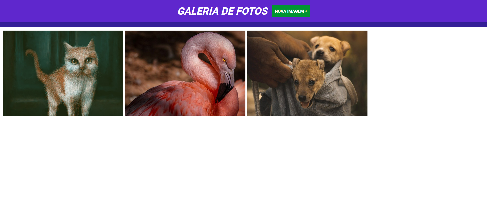
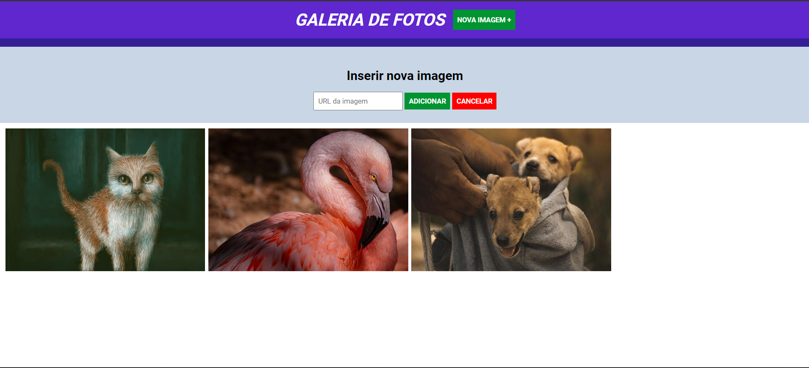
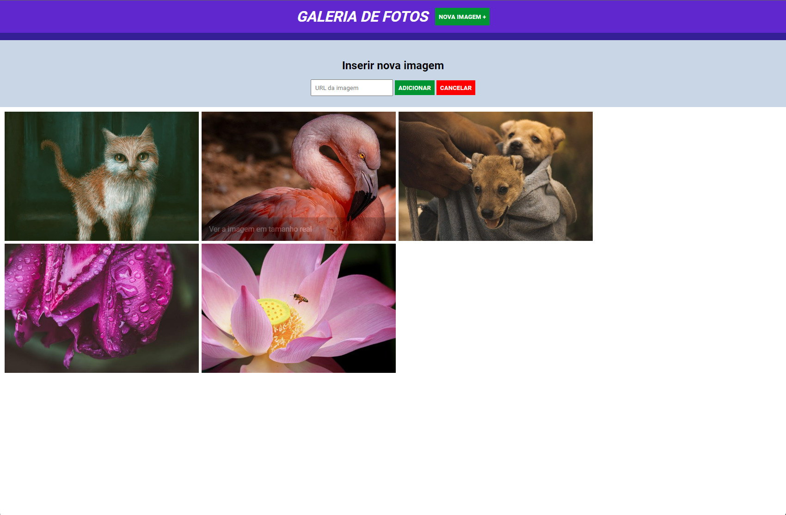

# jQuery study


This application explores the use of the jQuery to dynamically display information on the screen as the user interacts with it and to control inputs. It allows the user to post/collect different pictures that exist online.

## Index
- <a href="#functionalities">Application functionalities</a>
- <a href="#layout">Layout</a>
- <a href="#demonstration">Demonstration</a>
- <a href="#run">How to run the application</a>
- <a href="#tecnologies-used">Tecnologies used</a>
- <a href="#developer">Developer</a>

## Application functionalities
 - [x]  Enter the link to a picture online
 - [x]  Information shown as the user interacts with the application

## Layout





## Demonstration
[Link (deploy)](https://jquery-study.vercel.app/)


## How to run the application
```bash
# Clone this repository
$ git clone repolink

# Acess the app folder on your terminal
$ cd jquery-study

# Utilize a local server launch tool to view the application in your browser

```

## Tecnologies used
1. HTML
2. CSS
3. DOM
4. Javascript
5.jQuery

## Developer
[LinkedIn](https://www.linkedin.com/in/julia-silva-borges/)

C:\Users\julia\Desktop\Curso Full Stack\4-Python Full Stack\frontend\3-jquery\images
